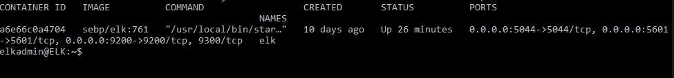

## Automated ELK Stack Deployment

The files in this repository were used to configure the network depicted below.

These files have been tested and used to generate a live ELK deployment on Azure. They can be used to either recreate the entire deployment pictured above. Alternatively, select portions of the _____ file may be used to install only certain pieces of it, such as Filebeat.

elk.yml 
---                                                                                                    
- name: Configure Elk VM with Docker
  hosts: elk
  remote_user: elkadmin
  become: true
  tasks:

    - name: Install docker.io
      apt:
        update_cache: yes
        name: docker.io
        state: present

    - name: Install pip3
      apt:
        force_apt_get: yes
        name: python3-pip
        state: present

      e
    - name: Install Docker python module
      pip:
        name: docker
        state: present

    - name: Use more memory
      sysctl:
        name: vm.max_map_count
        value: "262144"
        state: present
        reload: yes

    - name: download and launch a docker elk container
      docker_container:
        name: elk
        image: sebp/elk:761
        state: started
        restart_policy: always
        published_ports:
          - 5601:5601
          - 9200:9200
          - 5044:5044

    - name: Enable service docker on boot
      systemd:
        name: docker
        enabled: yes

This document contains the following details:
- Description of the Topology
- Access Policies
- ELK Configuration
  - Beats in Use
  - Machines Being Monitored
- How to Use the Ansible Build

### Description of the Topology

The main purpose of this network is to expose a load-balanced and monitored instance of DVWA, the D*mn Vulnerable Web Application.

Load balancing ensures that the application will be highly available, in addition to restricting unwanted access to the network.

Integrating an ELK server allows users to easily monitor the vulnerable VMs for changes to the files and system metrics.

The configuration details of each machine may be found below.

| Name     | Function  | IP Address     | Operating System |
|----------|-----------|----------------|------------------|
| Jump Box | Gateway   | 13.92.100.16   | Linux            |
| Web1     | DVWA      | 10.0.0.8       | Linux            |
| Web2     | DVWA      | 10.0.0.9       | Linux            |
| ELK      | ELK Stack | 10.1.0.4       | Linux            |

### Access Policies

The machines on the internal network are not exposed to the public Internet. 

Only the Jumpbox machine can accept connections from the Internet. Access to this machine is only allowed from the following IP addresses:
- Local Machine IP Address

Machines within the network can only be accessed by using the Jump Box machine.
- 10.0.0.7

A summary of the access policies in place can be found in the table below.

| Name     | Publicly Accessible | Allowed IP Addresses |
|----------|---------------------|----------------------|
| Jump Box | Yes                 | Local Machine        |
| Web1     | No                  | 10.0.0.7             |
| Web2     | No                  | 10.0.0.7             |
| ELK      | No                  | 10.0.0.7             |

### Elk Configuration

Ansible was used to automate configuration of the ELK machine. No configuration was performed manually, which is advantageous because...
- The main advantage is the ability to do multiple tasks simultaneusly.

The playbook implements the following tasks:
- Install docker
- Install pip3
- Install docker python module
- Use more memory in VM
- Download and launch docker elk container
- Enable service docker on boot

The following screenshot displays the result of running `docker ps` after successfully configuring the ELK instance.

### Target Machines & Beats
This ELK server is configured to monitor the following machines:
- Web1: 10.0.0.8
- Web2: 10.0.0.9

We have installed the following Beats on these machines:
- Filebeat
- Metricbeat

These Beats allow us to collect the following information from each machine:
- Filebeat: Forwards and centralizes log data. It only monitors the files or locations that you specify and forwards them to Elasticsearch or Logstash.
- Metricbeat: Periodically collects metric data from servers. Examples being CPU or memory data and can be used to monitor ELK stack itself.

### Using the Playbook
In order to use the playbook, you will need to have an Ansible control node already configured. Assuming you have such a control node provisioned: 

SSH into the control node and follow the steps below:
- Copy the elk.yml file to /etc/ansible/files.
- Update the /etc/ansible/hosts file to include the server IP addresses under [webservers] along with the ELK stack machine listed under [elk]
- Run the playbook, and navigate to 20.96.125.245:5601 to check that the installation worked as expected.
